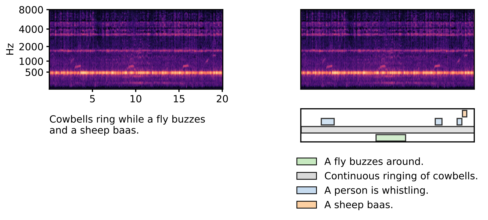

# TACOS: Temporally-Aligned Audio Captions for Audio-Language Pretraining

This repository contains implementation details of **[“TACOS: Temporally-aligned Audio CaptiOnS for Language-Audio Pretraining”](https://arxiv.org/pdf/2505.07609)**. 

TACOS is a dataset with **strong captions**, i.e., textual description of acoustic events with their corresponding temporal onsets and offsets.

The dataset can be downloaded via Zenodo: [https://zenodo.org/records/15379789](https://zenodo.org/records/15379789)
## Overview

Traditional audio-language models rely on **global (clip-level) captions**, which occasionally provide a rough temporal position of acoustic events.

TACOS solves this by providing:
- **12,358** audio recordings annotated with
- **47,748 temporally-aligned captions** linked to specific regions
The region's on- and offsets can be used to provide stronger supervision during text-audio pretraining.

The following figure illustrates the difference between weak captions (left) and strong captions (right):


## Quick Start to Run Experiments

### Installation

Prerequisites
- linux (tested on Ubuntu 24.04)
- [conda](https://www.anaconda.com/docs/getting-started/miniconda/install), e.g., [Miniconda3-latest-Linux-x86_64.sh](https://repo.anaconda.com/miniconda/Miniconda3-latest-Linux-x86_64.sh)

1. Clone this repository.

```
clone git@github.com:OptimusPrimus/tacos.git
```

2. Create and activate a conda environment with Python 3.11:

```
conda create -n d25_t6 python=3.11
conda activate d25_t6
```

3. Install 7z

```
# (on linux)
sudo apt install p7zip-full
# (on linux)
conda install -c conda-forge p7zip
# (on windows)
conda install -c conda-forge 7zip
```


4. Install a [PyTorch](https://pytorch.org/get-started/previous-versions/) version that suits your system. For example:

```
# for cuda >= 12.1 (check with nvidia-smi)
pip3 install torch torchvision torchaudio
# for cuda 11.8
pip3 install torch torchvision torchaudio --index-url https://download.pytorch.org/whl/cu118
# for otther versions see: https://pytorch.org/get-started/locally/
```

5. Install other dependencies:
```
pip3 install -r requirements.txt
CFLAGS='-O3 -march=native' pip install https://github.com/f0k/minimp3py/archive/master.zip
```

6. If you have not used [Weights and Biases](https://wandb.ai/site) for logging before, you can create a free account. On your
machine, run ```wandb login``` and copy your API key from [this](https://wandb.ai/authorize) link to the command line.

7. Download TACOS Dataset.
The dataset is available on Zenodo:
- [https://zenodo.org/records/15379789](https://zenodo.org/records/15379789)
- place it into the folder called `data` in the main directory

8. Download AudioSet Stong
- AudioSet recordings are not publicly available due to licensing issues.
- A download script will be provided upon request to paul.primus@jku.at. 

## Example Training Command

Pre-Training on Clotho
```bash
python -m tacos.train \
  --data_path=data \
  --strong_weight=0.0 \
  --weak_weight=1.0
```
Strong Fine-Tuning on TACOS
```bash
python -m tacos.train \
  --no-clotho \
  --tacos \
  --data_path=data \
  --strong_weight=1.0 \
  --weak_weight=0.0 \
  --test_on_audioset \
  --test_on_audioset_full \
  --load_ckpt_path=PATH_TO_PRETRAINING_CHECKPOINT.ckpt
```

### Citation

If you use our dataset, please cite our WASPAA paper:
- TACOS: Temporally-aligned Audio CaptiOnS for Language-Audio Pretraining

